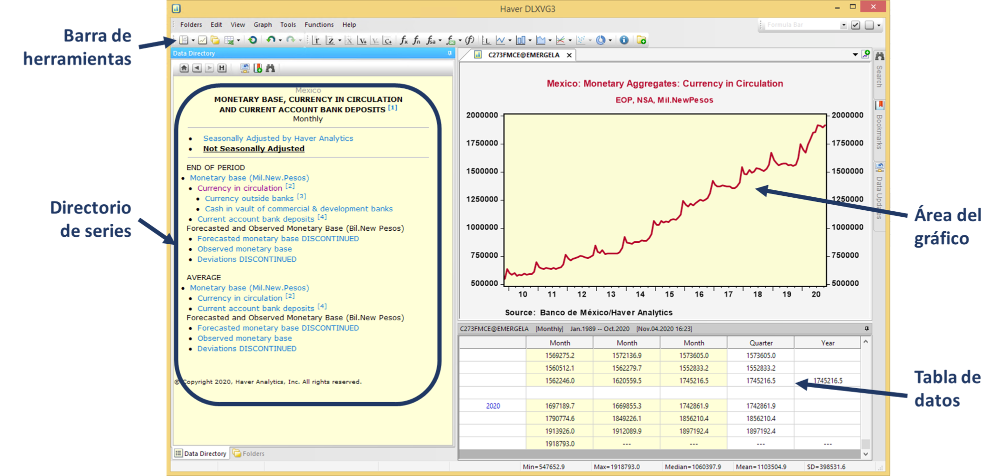
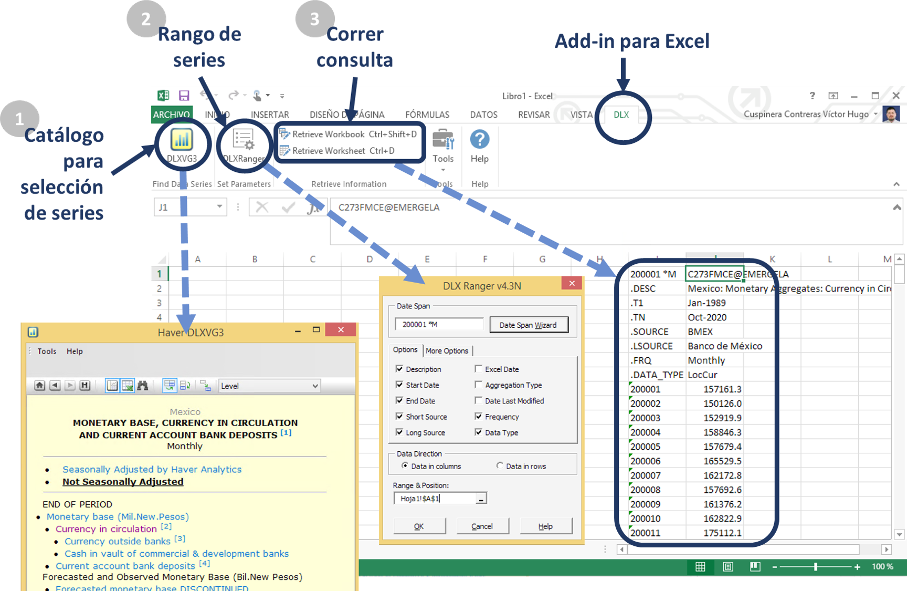
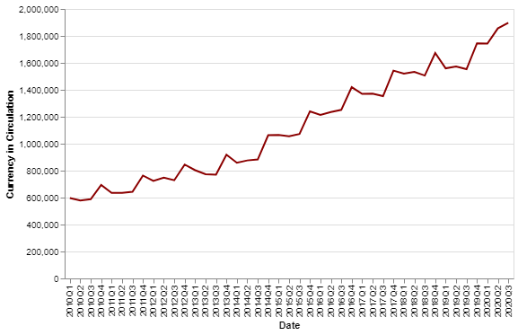

--- 
title: "Guía para usar Haver Analytics"
author: "Victor Cuspinera"
date: "`r Sys.Date()`"
site: bookdown::bookdown_site
documentclass: book
bibliography: [book.bib, packages.bib]
biblio-style: apalike
link-citations: yes
description: "Guía para usar Haver Analytics, enfocándose en las series relacionadas con el dinero en efectivo y herramientas que podrían ser útiles a la Oficina de Estadística de la Dirección General de Emisión del Banco de México."
---

# Introducción {#intro}

@haver es una empresa que se encarga de coleccionar información económica, financiera y monetaria, a nivel global de distintas fuentes oficiales. 

El @haver_banxico tiene contratado una subscripción a algunas de las bases de datos de esta empresa, por lo que cualquier trabajador del banco puede solicitar el acceso a esta información sin incurrir en costo adicional alguno.

Algunas de las bases que se tienen contratadas son:

1. U.S. ECONOMIC STATISTIC (USECON). Estadísticas económicas y financieras básicas de Estados Unidos, actualizadas a pocos minutos del lanzamiento.

3. COUNTRY SUMMARY STATISTICS (G10+). Indicadores macroeconómicos y financieros de países desarrollados  como Estados Unidos, Canadá, Unión Europea, Japón, Australia y Nueva Zelanda.

4. COUNTRY SUMMARY STATISTICS (EMERGE). Indicadores macroeconómicos y financieros para más de 80 países de mercados emergentes.

5. LATIN AMERICAN MACROECONOMIC DATA (EMERGELA). Información económica y financiera para 16 países de América Latina. 

6. CENTRAL & EASTERN EUROPE and WESTERN ASIA (EMERGECW). Información económica y financiera de 24 países de Europa del Este, Central y países de Asia occidental.

7. MIDDLE EAST and AFRICAN EMERGIN MARKETS (EMERGEMA). Información económica y financiera para 26 países de Oriente Medio y los países africanos.

8. ASIA/PACIFIC RIM EMERGING MARKETS (EMERGERPR). Información económica y financiera para 15 economías en Asia-Pacífico.

9. FOCUS ECONOMIC CONSENSUS. Información histórica sobre expectativas de indicadores económicos para una variedad de economías.


[Da click aquí](http://webinterno/centro-de-informacion-electronica/acceso-a-recursos-electronicos/bases-de-datos-con-informacion-estadistica/haver-analytics-global/haver-analytics-global--.html) para revisar con mayor detalle los servicios contratados por Banxico a Haver Analytics.


## Salvedad de uso
⚠ El contenido de este documento interno, así como las conclusiones que de éste se deriven, son responsabilidad exclusiva del autor y no reflejan necesariamente las del Banco de México.

<!--chapter:end:index.Rmd-->

# Prerequisitos {#prereq}

## Instalación del software
Para poder usar Haver Analytics es necesario solicitar la instalación del paquete __DLX 7.00.000__, el cual es una _"aplicación DLXVG3 diseñada para explotar la información de las series de tiempo de Haver Analytics"_.^[Descripción en el _Catálogo de Software_ de Banxico.]

__¿No sabes cómo solicitar la instalación?__  
Ingresa al [webinterno](http://webinterno), y sigue la siguinte ruta:  

> \> _Webinterno  
> &nbsp;\> Tecnologías de la información  
> &nbsp;&nbsp;\> Certificación y distribución de software  
> &nbsp;&nbsp;&nbsp; \> Solicitudes  
> &nbsp;&nbsp;&nbsp;&nbsp; \> Instalación/desinstalación de software (Varios paquetes en una ETB)_

Aquí encontrarás un formato que llenarás para solicitar la instalación del paquete __DLX 7.00.000__; posteriormente, una persona de la _Oficina de Cómputo Personal_ te contactará para realizar la instalación del paquete en tu equipo de cómputo.

Es importante solicitar el complemento (add-in) de este paquete para Excel al momento de la instalación.

<!--chapter:end:01-prereq.Rmd-->

# Acceso {#acceso}

Haver Analytics tiene distintas formas para consultar las series de tiempo que podemos usar:

## Aplicación DLX 

La forma más accesible y fácil para usar las series de tiempo de Haver Analytics es directamente desde su aplicación __DLX View & Graph__.  

```{r icono, echo=FALSE, fig.cap="Ícono de aplicación de DLX.", out.width = '25%', fig.align='center'}

```

En esta aplicación se pueden seleccionar las series de interés, ver su gráfica y bases de datos, lo cual es muy intuitivo. En la barra superior se encuentran opciones más avanzadas con las cuales se pueden añadir múltiples series, exportar las bases de datos a Excel, personalizar funciones utilizando las series, dar formato a la gráfica, entre otras opciones.

```{r app, echo=FALSE, fig.cap="Aplicación DLX para Haver Analytics.", out.width = '100%', fig.align='center'}

```

## Add-in para Excel

Las series de Haver Analytics se pueden consultar directamente desde Excel utilizando el _add-in_ DLX. Para verificar si se tiene instalado este complemento, en Excel deberías tener una pestaña que diga __DLX__. 

Una vez seleccionada la pestaña, se deben seguir los siguientes pasos:

1. __Seleccionar las series__, dando click en el ícono __DLXVG3__, el cual abre un catálogo para seleccionar las series.

2. __Seleccionar rango__, usando el ícono __DLXRanger__, seleccionar la frecuencia y rangod e fechas de las series de tiempo.

3. __Correr la consulta__, la cual se puede correr para la hoja seleccionada dando click en "Retrieve Worksheet", o todas las series del archivo dando click en "Retrieve Workbook".

```{r addin, echo=FALSE, fig.cap="DLX add-in para Excel.", out.width = '100%', fig.align='center'}

```

## Consulta con R

El primer paso es instalar el paquete, corriendo la siguiente línea desde R o RStudio:

`install.packages("Haver", repos="http://www.haver.com/r/")`

Después habrá que llamar las librerías y fijar la ruta a las bases de datos con los siguientes comandos:

```{r llamar_libreria, echo=TRUE, message=FALSE}
# llamar librería de Haver Analytics y tidyverse
library(Haver)
library(tidyverse)

# fijar la ruta de las bases de datos
haver.path()

```

Posteriormente hay que llamar a las series que nos interesen, y su metadata, las cuales se pueden graficar o manipular.

```{r consulta_en_R, echo=TRUE}
# ejemplo de consulta de serie
currency <- haver.data(codes=c("c273fmce"), database = "EMERGELA", freq="q", start=as.Date("2010-01-01", format="%Y-%m-%d"))

# cambio de nombre
colnames(currency)[colnames(currency) == "c273fmce"] <- "Currency_in_Circulation"

# ver inicio de serie para identificar su estructura
currency %>% head()

# imprimir metadata
haver.datamd(currency)

# convertir serie a data.frame
currency <- data.frame(currency)
currency$date <- row.names(currency)

# gráficar serie
currency %>% ggplot() +
  geom_line(aes(x = date, 
                y = Currency_in_Circulation, 
                group = 1), color="darkred") +
  theme_bw() +
  theme(axis.text.x = element_text(angle = 60, vjust = 0.5)) + 
  scale_x_discrete(breaks = currency$date[seq(1, length(currency$date), by = 2)])+
  scale_y_continuous(limits = c(500000, 2000000), 
                     labels = scales::dollar) +
  labs(x = "Date", y = "Currency in Circulation")
```

Para acceder a la guía completa del paquete `Haver` en R puedes:

- correr el siguiente comando en RStudio: `help("Haver")`, o

- ingresar a la página oficial de [Haver Analytics](http://www.haver.com), dar click en _Client area_ donde te pedirán un código de usuario el cual te lo pueden dar a través del correo <data@haver.com>, seleccionar _Resources_, después ingresar en _Using DLX Data with Third Party Statistical Software_, y selecionar la __guía de usuario para R__ [@haver_r].


## Consulta con Python

El primer paso es instalar el paquete de Haver en Python, lo cual se puede relaizar de la siguiente manera:^[Basado en script para uso de Haver por primera vez, compartido por @haver_python_install de Haver Analytics.]

- __interfaz__: desde PowerShell/Terminal, correr el siguiente comando:   

```
pip install Haver --extra-index-url https://urldefense.proofpoint.com/v2/url?u=http-3A__www.haver.com_Python&d=DwIGAg&c=AKs6EwELrBZKOG9H-C2eL9nCFyT6KLG5z2zMuwOnNTA&r=1xye9t3tMb09G6CmueM5cDX4CvWN9LC-lHqLRumN6Ls&m=OzpuOY3Klwky0-MpBXHqoFFIN7cUKTHg3FHaKc18LaY&s=yWr_0mX3wkhn60y5OE2ZDv2Hb-rIrBaVzLVAmE0ghkA&e=  --trusted-host https://urldefense.proofpoint.com/v2/url?u=http-3A__www.haver.com&d=DwIGAg&c=AKs6EwELrBZKOG9H-C2eL9nCFyT6KLG5z2zMuwOnNTA&r=1xye9t3tMb09G6CmueM5cDX4CvWN9LC-lHqLRumN6Ls&m=OzpuOY3Klwky0-MpBXHqoFFIN7cUKTHg3FHaKc18LaY&s=KJOUUR_knntVVk2lyRqTBi8i7JLK_cfqqjh5Kcu1ReE&e=
```
...si esto no funciona, se tiene que realizar una instalación manual.

- __manual__:
  1. ingresar a la página <http://www.haver.com/Python/Haver/>, 
  2. descargar el archivo de formato `wheel`, con extensión 'whl', que corresponda a la versión que tengas instalada de Python. Por ejemplo, el archivo `Haver-1.1.0-cp35-cp35mwin_amd64.whl` corresponde a la versión instalada de Python 3.5
  3. Desde PowerShell/Terminal, ir a la carpeta donde se encuentre el archivo descargado en el punto anterior y correr el siguiente comando reemplazando 'archivo_wheel' por el nombre del archivo descargado

```
pip install archivo_wheel.whl
```

Ya instalado el paquete de Haver en Python, podemos empezar a trabajar ya sea directamente con Python o a través de alguna de sus interfaces (Jupyter Lab, Jupyter Notebook, Spider). Lo primero que tenemos que hacer es llamar las librerías y fijar la ruta a las bases de datos con los siguientes comandos:

```{r call_reticulate, echo=FALSE, warning=FALSE}
# llamar a reticulate para usar python en Rstudio
library(reticulate)
```

```{python import_and_path, message=FALSE}
# llamar librerias de Python
import Haver as hv
import pandas as pd
import numpy as np
import altair as alt

# fijar la ruta de haver
hv.path()

```

Posteriormente hay que llamar a las series que nos interesen, y su metadata, las cuales se pueden graficar o manipular.

```
# ejemplo de consulta de serie
currency = hv.data(codes=["c273fmce"], database="EMERGELA", 
                   frequency="q", startdate="2010-01-01")

# cambio de nombre
currency = currency.reset_index().dropna().rename(columns = {"index": "fecha", "c273fmce":"Currency_in_Circulation"})
currency.fecha = [str(i) for i in currency.fecha]

# obtener metadata
currency_md = hv.metadata(codes=["c273fmce"], database="EMERGELA").T

# graficar
alt.Chart(currency).mark_line(color="darkred").encode(
    x=alt.X('fecha', title="Date"),
    y=alt.Y('Currency_in_Circulation:Q', title="Currency in Circulation"),
    tooltip=['fecha', 'Currency_in_Circulation']
).properties(
    width=500
)
```



Para acceder a la guía completa del paquete `Haver` en Python puedes:

- ingresar a la página oficial de [Haver Analytics](http://www.haver.com), dar click en _Client area_ donde te pedirán un código de usuario el cual te lo pueden dar a través del correo <data@haver.com>, seleccionar _Resources_, después ingresar en _Using DLX Data with Third Party Statistical Software_, y selecionar la __guía de usuario para Python__ [@haver_python].

<!--chapter:end:02-acceso.Rmd-->

# Series {#series}

Como se mencionó en la introducción, el Banco tiene contratado una subscripción a algunas de las bases de datos de esta empresa, las cuales contienen diversas series.

[En este link](http://webinterno/centro-de-informacion-electronica/acceso-a-recursos-electronicos/bases-de-datos-con-informacion-estadistica/haver-analytics-global/haver-analytics-global--.html) podrás para revisar las bases de datos contratadas por Banxico a Haver Analytics.

Es importante mencionar que aunque algunas serie se encuentran replicadas en bases de datos distintas, estas pueden tener algunas pequeñas modificaciones para ajustarse a la periodicidad o formato de las otras series de la base de datos.

## Bases de datos
En el siguiente cuadro se muestran las 29 bases de datos contratadas por Banxico, junto con su descripción y número de series.^[Información consultada el 2020-11-24 en DLX y a través de Python.]

| Database | Group| Description | No. de series |
|:---------|:-----|:------------|--------------:|
|USECON  | U.S. Detail | United States Economic Statistics|63,934 | 
|SURVEYS | U.S. Detail | Surveys Including FED Special Series|68,888 |
|SURVEYW | U.S. Detail | Weekly Surveys of Economic Activity |32,164 |
| | | | |
|GLSECTOR |Industry Detail | Global Sector Statistics |277,412 |
| | | | |
|WARDSINT | Automotive Detail | Global, Ward's Automotive Data |528 |
| | | | |
|G10 | Advance Ecopnomies | Country Summary Statistics |17,968 |
| | | | |
|EMERGE | Emerging Markets | Country Summary Statistics |42,103 |
|EMERGELA | Emerging Markets | Latin America |70,705 |
|EMERGEPR | Emerging Markets | Asia Pacific |256,779 |
|EMERGECW | Emerging Markets | Central, Eastern Europe & Western Asia|252,574 |
|EMERGEMA | Emerging Markets | Middle East & Africa|152,190 |
|CHINA | Emerging Markets | CEIC Premium China Database |377,004 |
| | | | |
|EIUIAMER | EIU Market Indicators | Americas |4,948 |
|EIUIASIA | EIU Market Indicators | Asia & Australasia |6,957 |
|EIUIEEUR | EIU Market Indicators | Eastern Europe|4,406 |
|EIUIWEUR | EIU Market Indicators | Western Europe|7,543 |
|EIUIMENA | EIU Market Indicators | Middle East & North Africa|2,534 |
|EIUISUBS | EIU Market Indicators | Sub-Saharan Africa|1,,381 |
|EIUIREGS | EIU Market Indicators | World & Regional Aggregates|4,170 |
| | | | |
|IIFDATA | Institute of International Finance Forecasts | IIF Forecasts |16,161 |
| | | | |
|FELATA | Focuseconomics Consensus Forecasts | Latin & Central America |7,703 |
|FEAANZ | Focuseconomics Consensus Forecasts | Asia & Australia/New Zealand |8,069 |
|FEMAJR | Focuseconomics Consensus Forecasts | Major Economies & Euro Area |13,114 |
|FEEEUR | Focuseconomics Consensus Forecasts | Eastern Europe |8,465 |
|FELATAH | Focuseconomics Consensus Forecasts | Latin & Central America: Historical |39,000 |
|FEAANZH | Focuseconomics Consensus Forecasts | Asia & Australia/New Zealand: Historical |45,970 |
|FEMAJRH | Focuseconomics Consensus Forecasts | Major Economies & Euro Area: Historical |67,304 |
|FEEEURH | Focuseconomics Consensus Forecasts | Eastern Europe: Historical |48,610 |
|FXRATES | Focuseconomics Consensus Forecasts | Currency Conversion Database |391 |

## Código de Series

Las __series__ disponibles se pueden consultar de la siguiente forma:

- Navegando en el _Directorio de Series_ directamente en la aplicación DLX o en el add-in de Haver para Excel.
- Consultar las series de una base de datos en particular a través de Python:
```
import Haver
Haver.metadata(database='database_code')
```

El código completo de una serie se divide en 4 partes. Por ejemplo, el nombre completo de la serie de Dinero en Circulación es `C273FMCE@EMERGELA`, y se divide de la siguiente forma:

| C | 273 | FMCE | \@EMERGELA |
|---|-----|------|------------|
|tipo de ajuste| país | tema de la serie | base de datos | 

<br>

Algunas series que nos podrían ser de utilidad:

|Serie |Database |Descripción (en Inglés) |
|:-----|:--------|:-----------|
|C273FMCE | EMERGELA |  Mexico: Monetary Aggregates: Currency in Circulation (EOP, NSA, Mil.NewPesos)|
|C273XLDE | EMERGELA | Mexico: Exchange Rate (EOP, NewPeso/US\$)|
|N273XEUE | EMERGELA | Mexico: BoM Euro Exchange Rate (EOP, Peso/Euro)|
|N273XUKE | EMERGELA | Mexico: BoM UK Pound Sterling Exchange Rate (EOP, Peso/GBP)|
|N273NGDP | EMERGELA | Mexico: Gross Domestic Product at Market Prices (NSAAR, Mil.NewPesos)|
|N273NGPC | EMERGELA | Mexico: Gross Domestic Product at Market Prices (NSAAR, Mil.2013.NewPesos)|
|N273PJ |EMERGELA | Mexico: Consumer Price Index (NSA, Jul 16-31 2018=100)|
|N273EWUN | EMERGELA |Mexico: Minimum Wage: National (NSA, MXP/Day)|
|N273POP | EMERGELA |Mexico: Population (Persons)|
|N273TAUS | EMERGELA |Mexico: Tourist Arrivals by Air from United States (NSA, Persons)|
|N273TACA | EMERGELA |Mexico: Tourist Arrivals by Air from Canada (NSA, Persons)|
|N111FMC | G10 |U.S.: Money Supply: Currency (NSA, Bil.\$)|
|H111FMR | G10 |U.S.: Monetary Base (SA, Bil.\$)|
|N023FMC | G10 |EA 11-19: MFIs: Liab: Currency in Circulation (EOP, NSA, Bil.EUR)|
|N023FMR | G10 |EA 11-19: Monetary Base (EOP, NSA, Bil.EUR)|
|A273NETS | EIUIAMOER |Mexico: Internet Users (Thous)|
|A273ATPT | EIUIAMOER |Mexico: Air Transport: Passengers (Thous)|

Estas son algunas de las series que podrían ser útiles para el área; existen series similares a estas para un gran número de países lo cuál hace fácil su comparación.  

Se recomienda revisar las series disponibles pues hay cerca de 1.9 millones de series en las 29 bases de datos contratadas por Banxico a Haver Analytics.

<!--chapter:end:03-series.Rmd-->

